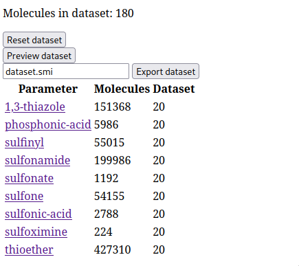
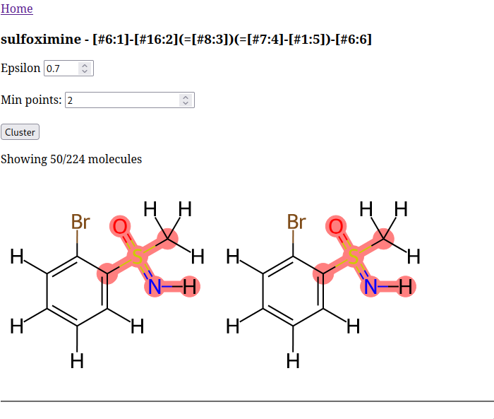
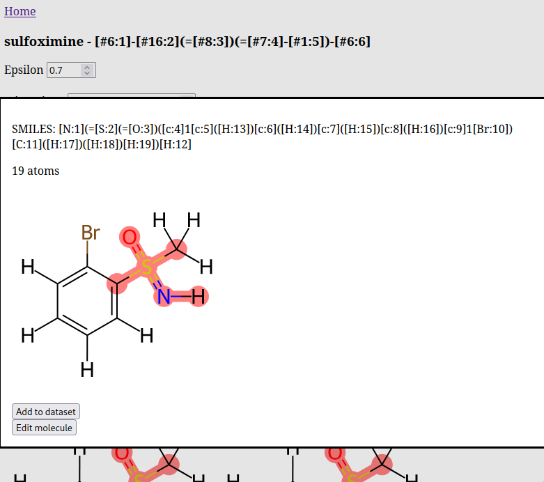
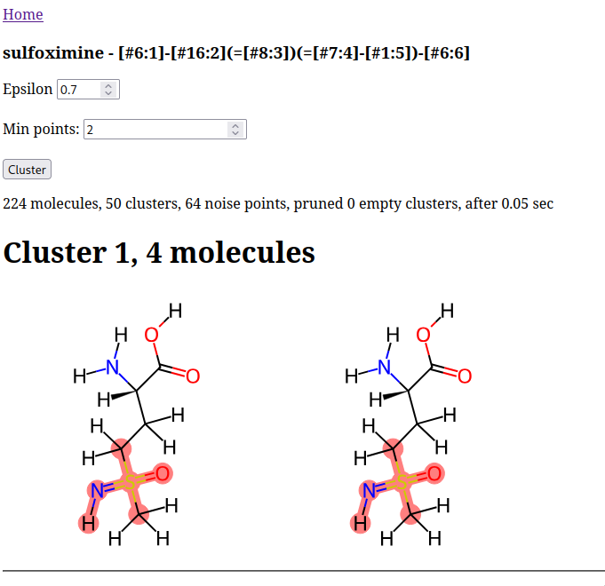
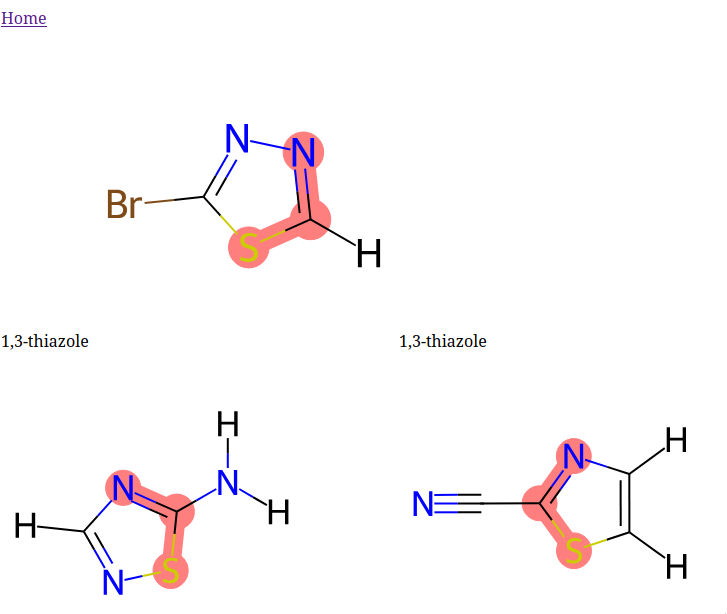

# curato
Chemical dataset curation

## Usage
There are three main phases to using cura, each of which is described in its own
section below. I never got around to making cura a proper package that you can
install and use directly in a conda environment, so current operation basically
assumes that you're working within the repo.

### Storing data in the database
The first cura subcommand is `store`, currently invoked with something like
```shell
python cura/store.py FILENAME [-n NPROCS] [-t TOTAL]`
```

`FILENAME` is the required name of a file containing a list of SMILES to load
into the database. The optional `NPROCS` sets the size of the
`multiprocessing.Pool` to use for parallelizing the molecule processing, and
`TOTAL` is an optional total number of lines used for progress reporting[^1].

The main output from this phase is a SQLite database containing two tables:
* `molecules` - which contains the full molecules loaded from the dataset
* `fragments` - which contains molecule fragments generated using the XFF
  fragmentation algorithm

The schemas of these two tables are quite similar, with the `fragments` table
just missing the `inchikey` field since RDKit can't compute an InChI for
fragments with dummy atoms (like `*#CC([H])([H])Br`). Here's the `molecules`
schema:

```sql
CREATE TABLE molecules (
	id integer primary key,
	smiles text unique,
	inchikey text unique,
	natoms int,
	elements blob,
	tag text
);
```

There's an automatically-generated `id` field used as the primary key in the
database, followed by the SMILES and InChIKey values as strings, then the number
of atoms and elements (represented as a 128-bit bit set), and finally a `tag`,
which can be any text but usually corresponds to the name of the database or
file from which the molecule was loaded. This allows multiple datasets to be
loaded into the same database without any ambiguity. Note also the `UNIQUE`
constraint on `smiles` and `inchikey`; this means there cannot be multiple
molecule entries with identical `smiles` or `inchikey` fields. In short, there
are no duplicate molecules.

#### Possible extensions
The file `lipidmaps.py` contains a few logical extensions to this database
schema and also serves as an example of using cura as a library. The main
extensions are storing the number of heavy atoms in the `molecules` and
`fragments` tables under the name `nheavy` and storing the 2048-bit Morgan
fingerprints as bit strings under the name `morgan`. This enabled very rapid
clustering of the LIPID MAPS database by querying the database for molecules of
the right size and getting their fingerprints without any additional
computation. I think it would make sense for these fields to be a normal part of
`cura.store`, but I haven't made those changes.

### Querying the database
Once the database is populated, `query.py` can be used to perform SMARTS queries
over the molecules and fragments. The command for doing this is something like:

``` shell
python cura/query.py [-n NPROCS=8] [-c CHUNKSIZE=32] [-x FILTERS]* \
	   [-s STORE=store.sqlite] [-f FFNAME=openff-2.1.0.offxml] \
	   [-t PARAMS=want.params]
```

As you can see, most of the options have defaults, but depending on your use
case, they may not be sensible defaults. `NPROCS` has the same meaning as above,
`CHUNKSIZE` controls the `chunksize` argument to `multiprocessing.Pool.imap`,
`STORE` is the path to the database generated by `store.py`, `FFNAME` is the
name of a force field readable by the openff-toolkit, and `PARAMS` is a file
containing parameter IDs in this force field. The combination of `FFNAME` and
`PARAMS` are used to extract the SMARTS patterns to search for in the database.

The `FILTERS` argument is more involved and deserves its own discussion. As the
`*` indicates, this argument can be provided multiple times with different
filters. The available filters are shown in the table below.

| Filter          | Description                  | Example                                        |
|-----------------|------------------------------|------------------------------------------------|
| `ElementFilter` | Filter by included elements  | `-x 'elements:Cl, P, Br, I, H, C, O, N, F, S'` |
| `NatomsFilter`  | Filter by number of atoms    | `-x 'natoms:80'`                               |
| `InchiFilter`   | Filter by existing InChIKeys | `-x 'inchi:inchis.dat'`                        |

The `ElementFilter` will include molecules that contain only a subset of the
listed atoms. `NatomsFilter` restricts the search to molecules with the provided
number of atoms or fewer. And the `InchiFilter` takes a path to a file
containing a set of InChIKeys to exclude from the search. This is useful for
ensuring a new dataset doesn't have any overlap with existing datasets.

A real invocation of `query.py` that I've used in the past was:

``` shell
python cura/query.py \
           -n $SLURM_CPUS_PER_TASK \
           -t input/sulfur.dat \
           -x 'natoms:80' \
           -x 'elements:Cl, P, Br, I, H, C, O, N, F, S' \
           -x 'inchi:input/inchis.dat'
```

cura also comes with the `query_smarts.py` script, which is very similar to
`query.py` but searches for SMARTS patterns directly provided in the `PARAMS`
file (and thus doesn't accept an `FFNAME` argument). Because the database also
uses the parameter IDs later, this file must actually contain SMARTS-name pairs,
but the names can be arbitrary strings. For example, for expanding sulfur
parameter coverage, I used an input file this:

```
[#6:1]-[#16:2](=[#8:3])(=[#8:4])-[#8:5]-[#1:6] sulfonic-acid
[#6:1]-[#15:2](=[#8:3])(-[#8:4]-[#1:5])-[#8:6]-[#1:7] phosphonic-acid
[#6:1]-[#16:2](=[#8:3])(=[#8:4])-[#6:5] sulfone
[#6:1]-[#16:2](=[#8:3])(=[#8:4])-[#8-:5] sulfonate
[#6:1]-[#16:2](=[#8:3])-[#6:4] sulfinyl
[#6:1]-[#16:2](=[#8:3])(=[#7:4]-[#1:5])-[#6:6] sulfoximine
[#6:1]-[#16:2](=[#8:3])(=[#8:4])-[#7X3:5] sulfonamide
[#6:1]-[#16:2]-[#6:3] thioether
[#16r5:1]@[#6r5:2]@[#7r5:3] 1,3-thiazole
```

The output of either of these scripts is another table in the database, called
`forcefields` with the following schema:

``` sql
CREATE TABLE forcefields (
	id integer primary key,
	name text unique,
	matches blob
);
```

This one is a little less useful in SQL alone because the `matches` blob is a
pickled `Match` object from `cura.store`, which contains a SMIRKS pattern, a
parameter ID, and a list of `molecule` and `fragment` IDs corresponding to that
SMIRKS pattern. Again, `query_smarts.py` doesn't actually require a force field
name, so the `name` field here will be populated with the name of the SMARTS
pattern file.

### Viewing the results of queries and generating datasets
The best way to use these somewhat opaque `Match` objects is by way of the
`serve.py` script, which contains a flask web application for viewing and
clustering molecules in the database and ultimately manually selecting molecules
to add to a dataset. As shown in the `Makefile`, the general command for running
the web server is:

``` shell
flask --app cura/serve.py run --debug
```

I couldn't figure out a good way to pass arguments to the application, so the
force field name of interest must be provided as an environment variable called
`FF`. For example, to load the sulfur parameter data that was queried from a
file called `input/sulfur.dat`, I used this command:

```shell
FF=input/sulfur.dat flask --app cura/serve.py run --debug
```

This will produce a simple web page like the one shown below at
`localhost:5000`.


Clicking on one of the parameter names takes you to a parameter-specific page
displaying all of the molecules matching this parameter, as shown below.



Clicking on a molecule will open a modal containing additional buttons allowing
you to add the molecule to a dataset or to edit the molecule. Unfortunately
editing the molecule currently doesn't work very well, so the main functionality
here is adding the molecule to the current dataset.



The cluster parameters at the top of the page are
[DBSCAN](https://en.wikipedia.org/wiki/DBSCAN) parameters that can be adjusted
in the HTML form before hitting the `Cluster` button. This clusters the
molecules based on their Morgan fingerprints and then displays a page very
similar to the initial parameters page, where you can again select molecules for
the dataset or recluster with new DBSCAN parameters.



Finally, back on the main page, you can preview the dataset:



And then export the dataset as a SMILES file to the named file. You can also use
the `Reset dataset` button to delete the current dataset and start over.
Probably it shouldn't be so close to the `Preview` and `Export` buttons!

[^1]: This could obviously be taken from the number of lines in the file, but
    some of these files are quite large, so you may not want to store all of the
    lines in a list just to count them. The current implementation only pulls
    lines as needed for processing.
